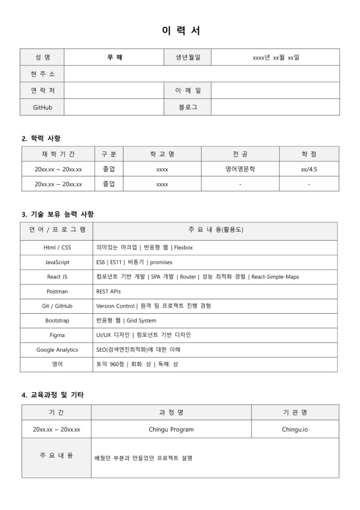

# 개발자 이력서

 

## 이력서 양식

|                 |                  |
:----------------:|:-----------------:
  |  
|                 |                  |

 

## 이력서 작성요령

 

### 사진은 경직되지 않은 것이 좋다.
- 대기업에 들어갈 것이 아니라면 너무 경직 된 사진보다는 자연스러운 것이 좋다.

### 정성적인 것 보다는 정량할 수 있는 것을.
- '소통 능력 원활' 같은 추상적인 것은 증명하기 어려우니 적지 말 것. 면접에서 이런 이야기가 나오면 불리해지기 마련.
- 특정 프레임워크나 라이브러리를 사용한 경험이 있다는 것을 관련 프로젝트와 함께 적는 것이 더 확실하다.

### 진행한 프로젝트는 최대한 구체적으로.
- 진행한 프로젝트가 있다면 어떤 것을 배우고 어떻게 활용해서 어떤 것을 만들었는지를 구체적으로 적어야한다. 신입에게 중요한 거은 배운 경험이다.

### 적당한 MSG
- 이력서에는 자신감 있는 태도가 필요하다. 경험한 것이면 자신있게 할 수 있다고 적는 것이 나를 나타내는 대에 더 좋다.
- 면접에 제대로 답변 할 수 있는 내용 작성해야한다. 모든것에 대답하는 것 보다는 태도가 더 중요하다.

### 이력서에 첨부 된 자기소개는 간결하게.
- 자기소개서의 구구절절한 이야기는 빼고 핵심만 간결하게 작성해햐한다.

---

## 이력서 참고

- 베테랑 개발자들이 인정한 필살 이력서 https://youtu.be/fv5pIa_l7ns

- Wonny https://wonny.space/writing/work/engineer-resume

- [이력서 예시](Resume_Dongjunkang_censored.pdf) (Resume_Dongjunkang_censored)

    |                                     |                                     | 
    :------------------------------------:|:------------------------------------:
    |
    |
    |                                     |                                     |

    